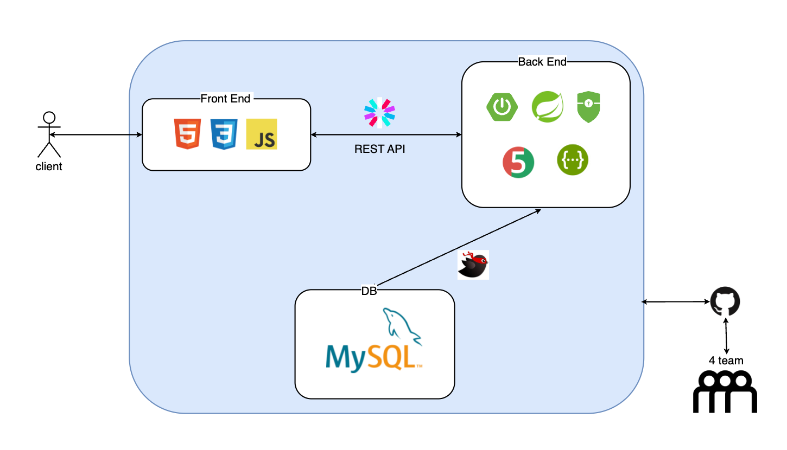
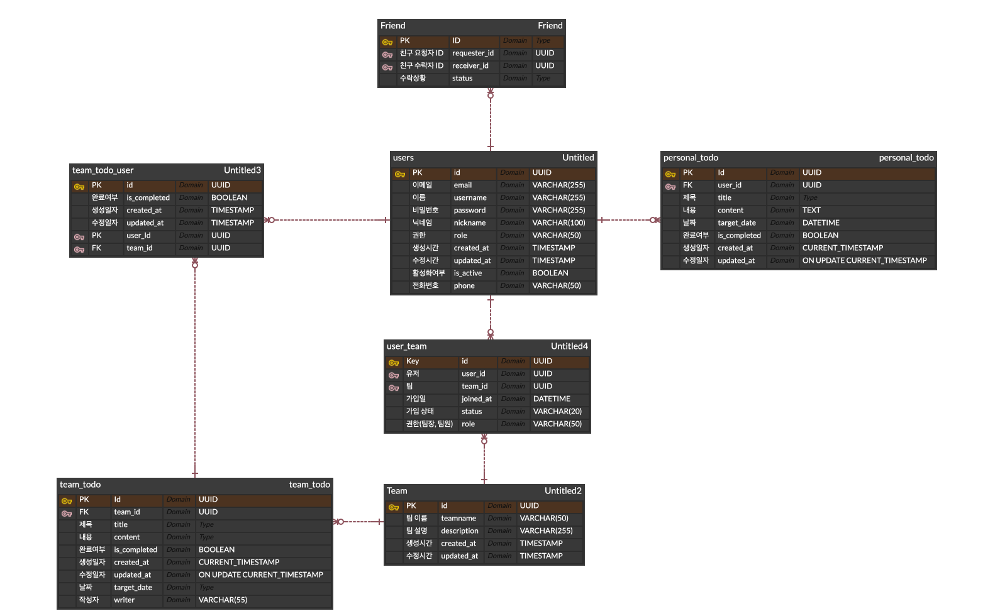

# 🗓️ 프로젝트 명 : PLAN!T

```
PLANiT는 우주 테마 기반의 일정/할 일 관리 웹 애플리케이션입니다.
사용자는 마치 자기만의 '계획 행성' 위에서 할 일을 정리하고 친구 그리고 팀과 공유할 수 있습니다. 
```  
# 🎯 프로젝트 목표
```
- Github issue, Pull Request, Git Commit, branch 전략을 활용한 협업 경험 쌓기
- Spring Sercurity를 사용한 인증/인가 구현
- MyBatis를 사용하여 최적의 쿼리 생성
- 사용자에게 개인, 친구, 팀 단위의 Todo 공유 및 CRUD 기능 제공
```
# 🏛️ 서비스 아키텍처


# ⚡ 기술 스택
## BackEnd
| Category                            | Tech            |
|-------------------------------------|-----------------|
| Backend                             | SpringBoot      |
|                                     | Spring          |
|                                     | Spring Security |
|                                     | MyBatis         |
|  Frontend                           | HTML            |
|                                     | CSS             |
|                                     | JavaScript      |
| DB                                  | MySQL           |
| Testing                             | Junit5          |
| contribute                          | Github          |
|  | Slack           |
|                                     | Swagger         |  
# 💾 ERD


# 🚀 주요 기능
| 기능               | 설명                                                                                                                                                                       |
|------------------|--------------------------------------------------------------------------------------------------------------------------------------------------------------------------|
| ✅ 회원가입 / 로그인     | - JWT 인증 방식             <br/>- @Valid와 프론트엔드 검증 로직을 통한 회원가입 입력값 검증<br/>- 중복 검사                                                                                           |
| 🔍 이메일 / 비밀번호 찾기 | - 이름, 전화번호 정보를 통한 이메일 찾기 <br/>- 찾은 이메일은 이메일 마스킹 처리 후 전달 (ex : planit@naver.com -> p****@naver.com) <br/>- 회원가입시 등록한 이메일로 비밀번호 재설정 링크(token값 포함) 전송(ConcurrentHashMap 활용) |
| 🗓️ 캘린더 연동       | - 날짜별 투두 CRUD<br/>- 완료 여부 체크                                                                                                                                             |
| 🧑‍🤝‍🧑 친구 추가   | - 친구 요청 및 수락<br/>- 친구 관계 기반 수락 버튼 다양화 <br/>- 친구간의 투두 열람 허용                                                                                                               |
| 👥 팀 기능          | - 팀 정보 CRUD(팀장만)<br/>- 팀원 초대, 추방(팀장만)<br/>- 팀 초대 수락, 거절<br/>- 팀 투두 작성(팀장만)<br/>- 팀 두두 개인별 완료여부 체크                                                                        |
| 🔐 보안            | - 비밀번호 암호화<br/>- Security Config 설정을 통한 비로그인 사용자 접근 차단<br/>- @TeamCheck, @FriendCheck Custome Annotation과 AOP를 활용한 팀 권한, 친구 권환 체크                                        |
| 👤 마이페이지         | - 로그인한 사용자 개인정보 확인<br/>- 닉네임, 비밀번호 변경<br/>- 계정 비활성화(비활성화시 검색에서 제외), 로그인시 자동 활성화<br/>- 회원탈퇴(작성한 투두, 친구관계, 팀관계 연동 삭제)                                                      |


# 팀원 소개
| 이름      | 담당 역할                                                                                                                                                                                                                                                                                  | Github |
|---------|----------------------------------------------------------------------------------------------------------------------------------------------------------------------------------------------------------------------------------------------------------------------------------------|-------|
| 정유민(팀장) |                                                                                                                                                                                                                                                                                        |       |
| 박기환     |                                                                                                                                                                                                                                                                                        |       |
| 신수현     | - JWT, Spring Security 기반 인증/인가 구현<br/>- 회원가입 기능 구현<br/>- 토큰값이 내포된 비밀번호 재설정 링크를 통한 비밀번호 찾기 기능 구현<br/> -이름, 전화번호를 요구하는 이메일 찾기 기능 구현<br/>- 마이페이지 기능 구현<br/>- Custom Exception, GlobalException 생성 후 공통 예외처리 구현<br/>- @TeamCheck, @FriendCheck Custom Annotation 구현 및 AOP 설정<br/> - auth 관련, mypage, calander 프론트엔드 구현 및 협업 |  https://github.com/suhyun9764     |
